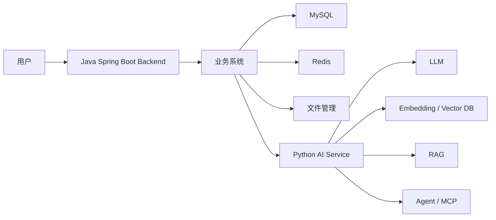

# Java 后端 + AI 应用开发统一学习路线

这是一套面向求职的长期学习工程：**Java 后端是主技术栈，Python / AI 应用开发是第二技术栈**。两条能力线最终汇入同一个“Java 智能知识库平台”，不再维护互相独立的 Java、Python、RAG、Agent 路线。

## 一分钟看懂当前状态

- 你实际学到的位置：**Stage 01 Java 基础，学习中**。
- 最可信的完成证据：你修改过 Java 基础示例，并编译运行过其中多天内容；`loop.java` 和 `method.java` 是后续练习实现。
- Stage 02–03：有完整参考材料，但没有打卡或独立练习证据，不能算已掌握。
- Stage 10–12：已有大量生成示例，但 Python TODO、真实 LLM API、真实 embedding/向量库和 RAG 评测都未完成。
- 当前下一步：完成 [Stage 01 验收](stages/stage01_java_basics/README.md)，再进入 OOP；不要现在跳到 Agent 或最终项目。

进度证据见 [真实学习进度.md](真实学习进度.md)，能力缺口和优先级见 [求职能力矩阵.md](求职能力矩阵.md)。

## 状态与优先级

- **已完成**：有自己的实现、验证结果和复盘记录。
- **学习中**：有实际练习证据，但尚未通过阶段验收。
- **已有材料**：示例或教程存在，不代表已经学会。
- **未开始**：没有学习证据，或关键内容尚不存在。
- **P0**：求职前必须掌握；**P1**：重要，第二轮深入；**P2**：当前了解即可。

## 统一 14 阶段主线

| Stage | 主线 | 当前状态 | 核心产出 |
| --- | --- | --- | --- |
| [01](stages/stage01_java_basics/README.md) | Java 基础 | 学习中 | 独立控制台程序 + 数组/方法题 |
| [02](stages/stage02_java_oop/README.md) | Java 面向对象与常用 API | 已有材料，未验证 | 一个独立完成的 OOP 小系统 |
| [03](stages/stage03_java_core/README.md) | 集合、泛型、异常、IO、Stream/Lambda | 已有材料，练习未完成 | 可持久化学生管理 + 核心数据结构题 |
| 04 | Java 进阶与计算机基础 | 未开始 | 多线程/线程池/JVM + 网络 + 算法基础 |
| 05 | MySQL | 未开始 | 表设计、SQL、索引/事务/锁/优化实验 |
| 06 | Java Web 与 Spring Boot | 未开始 | REST API + Spring 分层 + MyBatis |
| 07 | Redis 与后端进阶 | 未开始 | 缓存策略、登录会话、分布式锁实验 |
| [08](stages/stage08_engineering/README.md) | 软件工程能力 | 只有入门示例 | Git/测试/日志/Docker/部署闭环 |
| 09 | 简历项目 A：Java 后端项目实践 | 未开始 | 一个可测试、可部署、能解释取舍的传统后端项目 |
| [10](stages/stage10_python_for_ai/README.md) | Python 基础与 AI 开发准备 | 基础课程存在，未开始 | Python 基础练习 + 可测试的 FastAPI 服务 |
| [11](stages/stage11_llm_apps/README.md) | LLM 应用开发 | 仅 mock 示例 | 真实 API、结构化输出、streaming、tool calling |
| [12](stages/stage12_rag/README.md) | RAG | 生成示例存在，未学习 | 项目 B 的真实向量检索、reranker 与可重复评测 |
| 13 | Agent | 未开始 | 原理优先的 workflow、state、memory、MCP 与评测 |
| 14 | Java 智能知识库平台 | 未开始 | Java 业务系统 + Python AI 服务的最终汇合 |

未开始的阶段只保留在本路线中，**不创建空目录**。进入对应阶段时，再按教学模式创建教程、示例、TODO、测试和面试题。

## 学习方法：示例不是答案，运行不是完成

每个新知识点遵循同一闭环：

1. 教程：解释为什么需要、输入输出和常见错误。
2. 示例：一个最小、完整、可运行的例子。
3. TODO：由你实现核心练习，不预填答案。
4. 测试：正常、边界和异常用例。
5. Code Review：讨论命名、职责、可读性和复杂度。
6. 面试：用自己的话解释原理与取舍。
7. 证据：在 `真实学习进度.md` 记录代码路径、命令和复盘。

## 算法与面试贯穿主线

- Stage 01：数组、双指针入门。
- Stage 02：链表、栈、队列的对象建模。
- Stage 03：哈希、栈、队列、树、BFS/DFS、二分、滑动窗口。
- Stage 04–09：回溯、动态规划基础，并同步加入 JVM、MySQL、Spring、Redis 面试题。
- Stage 10–13：Python 基础、LLM/RAG/Agent 原理、评测与系统设计表达。

不等项目完成后才准备面试；每个阶段都要能讲“原理、代码、错误、取舍”。

## 项目梯度与简历口径

没有实习经历时，课程清单本身不够，必须用真实项目证明能力。本路线以 **2 个强项目** 为默认目标，不用十几个同质 CRUD 凑数量：

- **学习练习 / Mini Project**：Stage 01–03 的控制台程序、Stage 10 的文本统计器等，用于训练知识点和排错；通常不单独占简历项目栏。
- **简历项目 A：传统 Java 后端系统**：Stage 05–09 完成。它应有独立业务目标，覆盖 MySQL 表设计、Spring Boot/MyBatis、登录权限、Redis、测试、日志、接口文档、Docker 和一次真实部署。
- **简历项目 B：Java 智能知识库平台**：Stage 10–14 完成。它与项目 A 的业务目标不同，用 Java 承担业务系统、Python/FastAPI 承担 LLM/RAG/Agent 能力，最终完成联调和评测。

项目 B 中的 Python RAG 服务必须可以独立运行、测试和评测；但如果它只是项目 B 的一个模块，简历中不要再把同一份代码包装成第三个项目。只有在前两个项目已经通过验收、且目标岗位确实需要不同方向的证据时，才考虑第三个项目。

每个简历项目至少要有以下可核验证据：

- 自己的需求边界、数据模型、架构图和关键技术取舍。
- 可复现的启动方式、测试、接口文档、部署地址或部署记录。
- 真实问题复盘和 Git 提交历史，而不是只有一次性生成的成品代码。
- 与项目相符的指标：例如接口延迟/错误率、缓存命中情况，或 RAG 的 Recall@k、引用正确性和失败样本；没有测量就不写数字。
- 能现场解释并修改一个核心模块，能讲清至少 3 个错误、定位过程和改进方案。

早期学生、图书、银行、猜数字等代码继续保留为练习素材，不包装成多个同质项目。

## 两个简历项目什么时候开始

**现在先完成 Stage 01，不生成后续项目代码。** 两个项目按以下顺序推进：

1. Stage 05：为项目 A 选择一个明确业务场景，完成表设计与关键 SQL。
2. Stage 06：完成项目 A 的 Spring Boot、REST API、MyBatis、校验和统一异常。
3. Stage 07：为项目 A 增加登录权限、Redis 缓存、热点与会话。
4. Stage 08–09：补测试、日志、接口文档、Docker、部署和复盘，使项目 A 达到简历标准。
5. Stage 10：完成 Python 基础后再建立项目 B；先实现清晰的 Java/Python 接口契约和 FastAPI 健康检查。
6. Stage 11：为项目 B 加入真实 LLM 调用、结构化输出和工具调用。
7. Stage 12：加入文档解析、embedding、向量库、retriever/reranker、引用和评测。
8. Stage 13：加入受控 Agent workflow、state、memory、MCP 与可观测性。
9. Stage 14：完成联调、权限、安全、测试、部署、性能和基于真实贡献的简历材料。

## 什么时候可以开始投递

- **实习岗位**：完成 Stage 06 的可运行后端 MVP 后即可开始试投，同时继续补 Redis、测试与部署；不要等 14 个 Stage 全学完。
- **Java 后端校招/初级岗位**：Stage 09 项目 A 通过验收，Java/MySQL/Spring/Redis/算法等 P0 能力可解释时，进入主投递期。
- **AI 应用/RAG 岗位**：至少完成 Stage 12 的真实 API、向量库、引用和评测闭环，再把项目 B 写进对应简历。
- **Agent/复合型岗位**：完成 Stage 14 后投更可信；Agent 框架名称不能替代基础和项目证据。



## 当前不要学

- Kubernetes、复杂微服务、Service Mesh、复杂分布式架构。
- 把所有 AI 框架列成必修，或同时学习多个 Agent 框架。
- 在没有真实 embedding、向量库和评测前包装“完整 RAG 项目”。
- 在 Java 基础/OOP/集合未验收前跳 Spring Boot、Redis 或 Agent。
- 为了看起来高级而提前生成 Stage 14 全部代码。

## 仓库结构

```text
统一学习路线.md      # 唯一总路线入口
真实学习进度.md      # 真实进度与证据
求职能力矩阵.md      # 求职能力、优先级与缺口
requirements.txt     # 现有 Python 示例依赖
stages/              # 只包含已有有效内容的阶段
archive/             # 非活动旧脚手架；不属于学习路线
```

旧的两套路线路径已经合并；原有 Java 课程内容在 Stage 01–03 的 `existing_course/` 下原样保存，AI 生成代码被明确放在 `examples/` 下，避免误判为学习完成。`archive/` 只因安全机制阻止递归删除而保留旧脚手架、IDE/虚拟环境和生成器，不应继续编辑或用于判断进度。

## 常用验证命令

```powershell
# Python 语法（不会把生成代码算作学习完成）
python -m compileall .

# Java 示例：进入具体源码目录后编译
javac -encoding UTF-8 App.java
java App
```

路径均以仓库根目录为基准，不再依赖旧机器上的绝对路径。
